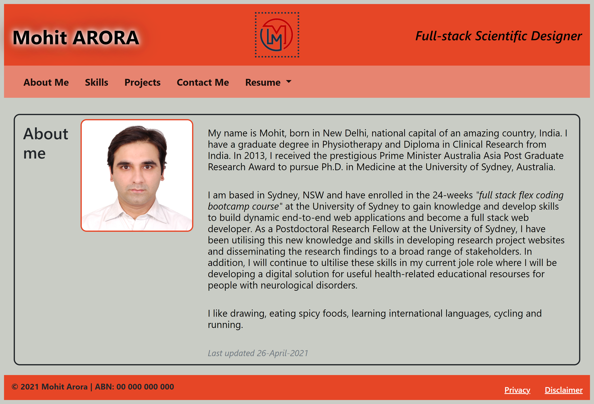
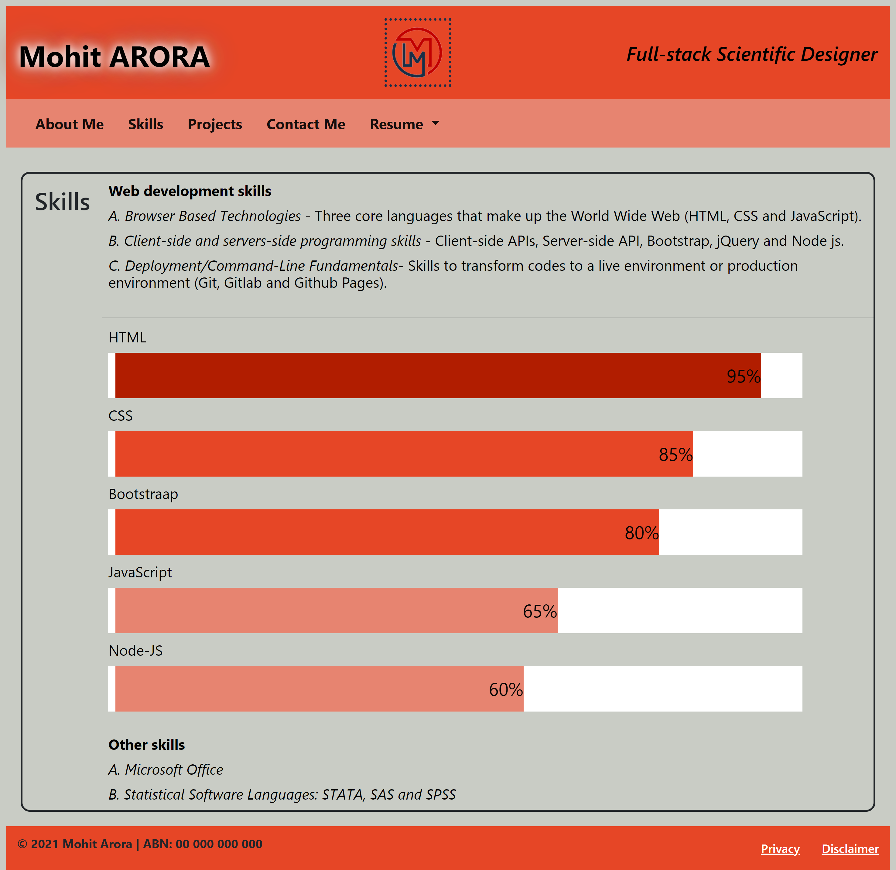
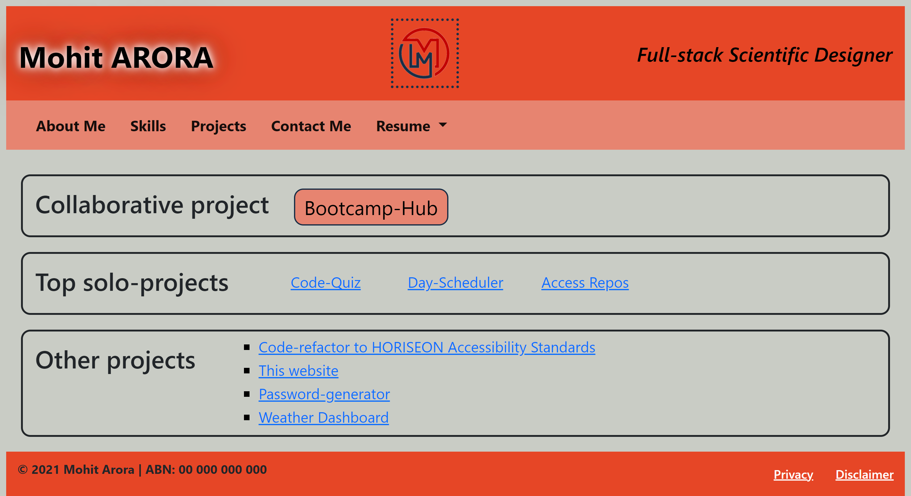
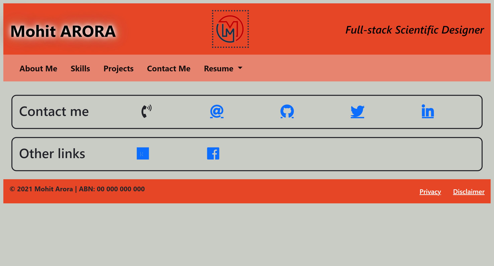

# portfolio-page

```
Mohit Arora
This webpage showcase my skills and talents to employers looking to fill a part-time or full-time position. This portfolio highlights some of my work as well as the thought processes behind creating this webpage.
```

## User Story
```
AS AN coding boot camp student
I WANT to show potential employers my deployed portfolio lisitng my skills and showcasing my work and projects
SO THAT they can review samples of my work and assess whether I am good fit for their organisation.
```

## Acceptance Criteria
```
GIVEN I need to create my own portfolio website
WHEN I load my portfolio
THEN I am presented with the my name, a recent photo, and links to sections about me - my skills, my projects, and how to contact them
WHEN I click one of the links in the navigation
THEN I ma re-directed to the component page
WHEN I click on the link to the projects section
THEN I am presented with the list of projects
WHEN I hover on any application
THEN that application should be larger in size than the others
WHEN I click on the application
THEN I am taken to that deployed application
WHEN I resize the page or view the site on various screens and devices
THEN I am presented with a responsive layout that adapts to my viewport
```

## Portfolio-page Deployed Link

https://marora7926.github.io/portfolio-page/

## Technology used
   1. HTML
   2. CSS
   3. JavaScript
   4. Bootstrap
   5. Font Awesome

# Screenshot - Landing page (About me)



## Screenshot - Skill page



## Screenshot - Project page



## Screenshot - Contact-ma page



---
© 2021 Mohit Arora. All Rights Reserved.

